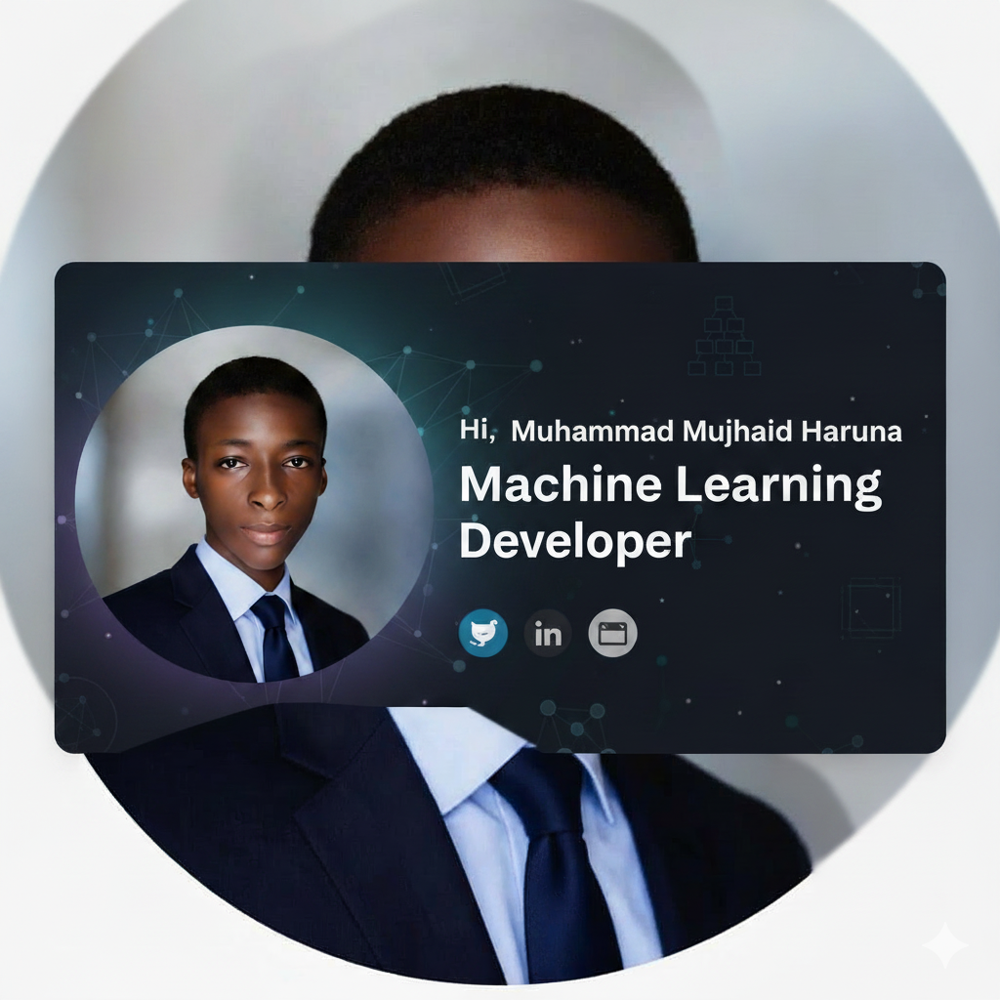

  

  <h1>Hi there 👋, I'm Muhammad Mujahid Haruna</h1>

  

    <strong>16 · Self-taught AI/ML Developer</strong> 
    <em>A painful, burning obsession with AGI, scientific ML Novel discovery
    and Problem Solving and a quiet ambition to be the
    god father of Machine Learning
    </em>
  

  
  

---

## ⚡ Who I Am

I'm a 16-year-old self-taught AI/ML developer with
Two years of learning — mostly on a phone, my borrowed Dad PC, no lab.
I didn't stop. I'm not stopping and still pushing harder.

---

## 🚀 Active Projects

> 🔒 *Details are intentionally vague. I build before I talk.*

**⚙️ PROJECT FORGE**
An AI system designed for self-evolution and autonomous self-improvement.
Architecture is being designed. Build begins soon.
*Collaborating with a Global Huawei AI Competition winner (2023/2024).*

**🤫 CLASSIFIED — Powered by Claude Code**
Engineering something with Anthropic's Claude Code
that nobody has attempted before.
Android. Autonomous. Dangerous.
You'll see it when it's done.

**📚 EduScribe**
An AI tool tackling a critical learning gap
faced by millions of students across developing nations.
Currently in design phase.

**🗺️ StreetPulse**
A real-time intelligence system built to help
governments reduce crime and respond faster
to critical incidents on the ground.
Built for Africa first.

---

## 📚 Currently Learning

- Large Language Models & Transformers *(to deeply understand what I disagree with)*
- Graph Neural Networks (GNNs)
- Agentic AI Systems

I also genuinely enjoy reading about new ML discoveries.
Especially in scientific AI research and frontier model development.

I also like reading about the **Prof. Yann LeCun.** on 
His arguments against pure autoregressive systems make sense to me

I believe the AGI we're racing toward won't be an autocomplete engine.
It'll be a system that **understands the world** — not just predicts the next token.

---

## 🛠️ My Stack

**Architectures:** ANN (deep understanding of backpropagation) · CNN · RNN · Exploring beyond

---

  <strong>"The best way to predict the future is to invent it."</strong>

---

  <em>
    "I build from Nigeria with a phone and borrowed compute. 
    Limitations don't stop the vision."
  </em>

